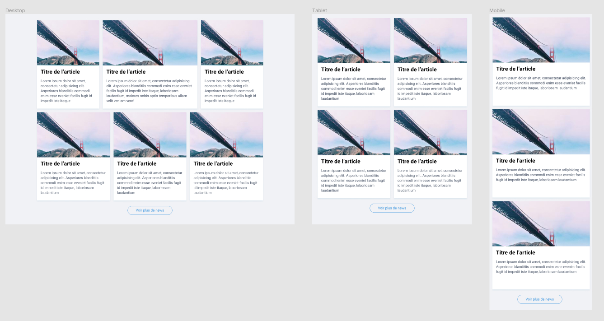

# Utilisation des Grilles & Flexbox

L'objectif de cet exercice est de réfléchir à la structure à adopter pour créer un layout particulier en minimisant le nombre de règles à créer.

## Scénario

On cherche à créer une structure originale pour nos articles. Une personne a déjà travaillé le style général des cartes et a besoin de votre aide pour construire la structure en fonction des différentes résolutions. 

**Quelques infos :**
- Les cartes sont espacées de 16px
- Le bouton est espacé de 24px par rapport aux cartes
- Sur grand écran la carte centrale a été mis en avant et a une largeur de 419px (cette valeur doit pouvoir être changé facilement via une variable CSS)
- Une class `.is-expanded` est ajouté au container lors du clic sur le bouton.

## Règles

- Vous ne pouvez éditer que le fichier app.css (pas de JavaScript en plus).
- Vous ne pouvez pas modifier le fichier HTML.
- Vous devez créer le fichier CSS le plus petit possible (on comparera le nombre de règles et la taille du fichier gzippé). Inutile de tout mettre sur une seule ligne par exemple.

