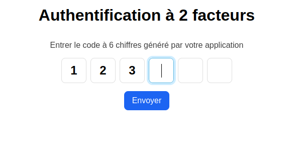

# Champs pour code d'authentification

Pour cet exercice, on cherche à créer un champ personnalisé pour permettre aux utilisateurs de rentrer un code à 6 chiffres



## Énoncé

Le client exige que plusieurs comportements soient présent pour considérer le composant comme valide (des tests sont disponibles pour confirmer ces comportements)

- L'interface doit correspondre au plus proche à celle de la capture
- Quand on tape un nombre dans un champ, le champ suivant doit se sélectionner
- On ne peut pas taper un caractère qui ne soit pas un chiffre
- On doit pouvoir coller un nombre
- La touche "Retour" (Backspace) doit permettre de supprimer les chiffre les uns à la suite des autres
- On doit générer un champ caché qui a la valeur qui correspond à ce que voit l'utilisateur.

Après une discussion avec l'équipe, vous convenez de la piste à adopter, un composant web qui permettra de réutiliser cet élément d'interface à plusieurs endroits.

```html
<code-input
    name="code"
    size="6"
    value="123456"
    legend="Entrer le code à 6 chiffres généré par votre application"
/>
```

Si l'attribut "value" change, il faut que l'interface reflète ce changement.

A vous de jouer !

## Environnement

Après avoir installé les dépendances à via `npm install` (ou autre gestionnaire) vous pourrez lancer la page contenant le formulaire à l'aide de la commande : 

```bash
npm run dev
```

Un serveur local sera lancé et sera accessible sur [localhost:5173](http://localhost:5173). Vous pouvez commencer à travailler sur le fichier `src/source.js`.

Pour tester que votre code corresponde aux attentes du client, vous pouvez lancer les tests à l'aide de la commande.

```bash
npm run test
```

Une fenêtre devrait s'ouvrir vous listant les tests et vous pouvez la laisser ouverte pendant que vous développer pour tester le code automatiquement à chaque changement de code.

Vous pouvez aussi comparer à la solution attendue en regardant http://localhost:5173/example.html
