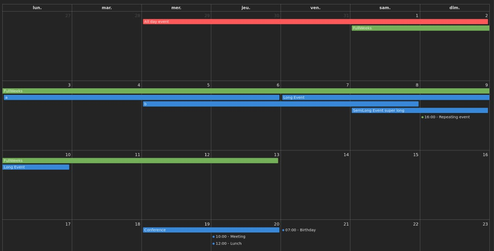

# Calendrier d'évènement

Pour cet exercice, on cherche à créer une visualisation capable d'afficher les évènements sous forme de calendrier mensuel



## Énoncé

Le client exige que plusieurs comportements soient présent pour considérer le composant comme valide (des tests sont disponibles pour confirmer ces comportements)

- On doit pouvoir afficher des évènements sur plusieurs jours
- On peut afficher des évènements qui ont lieu a une heure précise
- On ne souhaite pas utiliser de librairie comme fullcalendar car on veut avoir la main sur les évolutions.

## Environnement

Après avoir installé les dépendances via `npm install` (ou autre gestionnaire) vous pourrez lancer la page contenant le tableau à l'aide de la commande :

```bash
npm run dev
```

Un serveur local sera lancé et sera accessible sur [localhost:5173](http://localhost:5173). Vous pouvez commencer à travailler sur le fichier `src/main.js`. Les évènements sont disponibles dans le fichier `data.json`.

## Pour aller plus loin

Si vous voulez pousser un peu plus loin la reflection, vous pouvez prévoir le code pour gérer la navigation (un bouton mois suivant / mois précédent).
